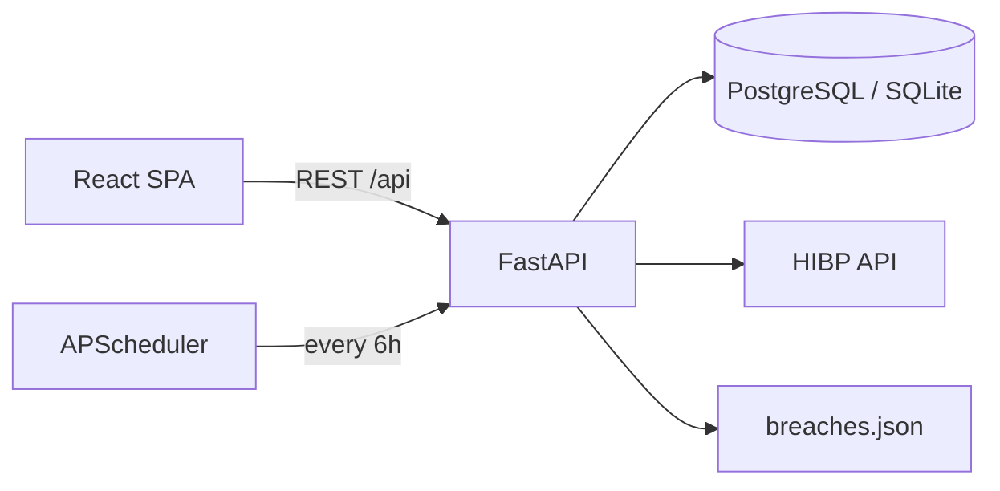

# DigiShield

**Real-time data breach alerts and cyber intelligence for citizens, legal teams, and government agencies.**

DigiShield monitors emails and domains against breach intelligence, generates risk-scored alerts, and surfaces actionable legal guidance under Indian frameworks (DPDP 2023, CERT-In, IT Act, RBI).

---

## Features

| Area | What it does |
|------|----------------|
| **Asset monitoring** | Track emails and domains; automatic rescans when new breaches are synced |
| **Breach alerts** | Severity-scored notifications with exposed data classes and remediation hints |
| **Analytics** | Dashboard views over breach trends and exposure patterns |
| **Legal intelligence** | Contextual guidance mapped to exposed data types (DPDP, CERT-In, IT Act, RBI) |
| **Reports** | Exportable summaries for compliance and incident workflows |
| **Audit trail** | API activity logged for accountability |

Breach data syncs from the [Have I Been Pwned](https://haveibeenpwned.com/) public corpus on startup and on a configurable schedule, with a local JSON fallback for offline demos.

Regenerate CERT-In style demo advisories (300 records):

```bash
python scripts/generate_cert_advisories.py
```

---

## Tech stack

| Layer | Stack |
|-------|--------|
| **Frontend** | React 19, TypeScript, Vite, Tailwind CSS 4, Recharts |
| **Backend** | Python 3.12, FastAPI, SQLAlchemy, APScheduler |
| **Database** | PostgreSQL (Docker/production) or SQLite (local dev) |
| **Auth** | JWT + bcrypt |
| **Deploy** | Docker Compose (Postgres + API + Nginx frontend) |

---

## Architecture



---

## Prerequisites

- **Docker path:** Docker Desktop (or Docker Engine + Compose)
- **Local path:** Node.js 20+, Python 3.12, pip (Conda optional)

---

## Quick start (Docker)

Recommended for demos and production-like runs.

```bash
docker compose up --build
```

| Service | URL |
|---------|-----|
| Frontend | http://localhost |
| Backend API | http://localhost:5000/api |
| API health | http://localhost:5000/ |

Optional environment overrides (create a `.env` in the repo root):

```env
DB_USER=postgres
DB_PASSWORD=password
DB_NAME=digishield
JWT_SECRET=your_secret
HMAC_SECRET=your_hmac_secret
```

---

## Local development

### Windows (fastest)

From the repo root:

```bat
start-all.bat      REM backend + frontend in two terminals
start-backend.bat  REM API  → http://localhost:8000 (uses conda env: digishield)
start-frontend.bat REM UI   → http://localhost:5173
```

`start-backend.bat` auto-activates the **`digishield`** Conda env (creates it with Python 3.12 if missing). To use a different env name, edit `CONDA_ENV=` at the top of `start-backend.bat`.

### 1. Backend

```bash
# Optional: use Conda
conda create -n digishield python=3.12 -y
conda activate digishield

cd backend-py
pip install -r requirements.txt

# Windows
copy .env.example .env
# macOS / Linux
# cp .env.example .env

uvicorn app.main:app --reload --port 5000
```

### 2. Frontend

In a second terminal, from the repo root:

```bash
npm install
npm run dev
```

| Service | URL |
|---------|-----|
| Frontend | http://localhost:5173 |
| Backend API | http://localhost:5000/api |

The frontend reads `VITE_API_URL` (defaults to `http://localhost:8000/api`). Copy the root `.env.example` to `.env`, or set:

```env
VITE_API_URL=http://localhost:8000/api
```

### 3. Try the demo

1. Sign up at http://localhost:5173/signup
2. Add a monitored asset such as `adobe.com` or `linkedin.com` (domains with known HIBP breaches)
3. Open **Alerts** and **Analytics** to see generated intelligence
4. Visit **Legal Intelligence** for framework-specific guidance

---

## Configuration

Backend settings live in `backend-py/.env` (see `.env.example`):

| Variable | Description | Default |
|----------|-------------|---------|
| `PORT` | API port | `5000` |
| `DATABASE_URL` | SQLAlchemy connection string | `sqlite:///./digishield.db` |
| `JWT_SECRET` | Signing key for access tokens | *(change in production)* |
| `HMAC_SECRET` | Pepper for sensitive field hashing | *(change in production)* |
| `CLIENT_URL` | Allowed CORS origin | `http://localhost:5173` |
| `HIBP_API_URL` | Breach corpus endpoint | HIBP v3 breaches API |
| `HIBP_USER_AGENT` | Required User-Agent for HIBP | `DigiShield-BreachMonitor/1.0` |
| `BREACH_SYNC_HOURS` | Scheduled sync interval | `6` |
| `FALLBACK_BREACHES_PATH` | Offline breach dataset | `data/breaches.json` |

For PostgreSQL locally, uncomment the `DATABASE_URL` line in `.env` and run Postgres (or use `docker compose up postgres`).

---

## API overview

Base path: `/api`

| Method | Endpoint | Description |
|--------|----------|-------------|
| `POST` | `/auth/register` | Create account |
| `POST` | `/auth/login` | Obtain JWT |
| `GET` | `/auth/profile` | Current user (auth required) |
| `GET` | `/assets` | List monitored assets |
| `POST` | `/assets` | Add email or domain |
| `DELETE` | `/assets/{id}` | Remove asset |
| `GET` | `/alerts` | List breach alerts |
| `PATCH` | `/alerts/{id}` | Update alert status |
| `GET` | `/breaches` | Breach corpus |
| `GET` | `/breaches/analytics` | Aggregated breach stats |
| `GET` | `/breaches/dashboard` | Dashboard summary |
| `GET` | `/intelligence/sync-status` | HIBP sync health |
| `GET` | `/intelligence/legal` | Legal guidance by data class |
| `POST` | `/intelligence/refresh` | Force sync + rescan |

Interactive docs (when the API is running): http://localhost:8000/docs

---

## Project structure

```
DigiShield/
├── src/                 # React frontend (pages, components, API client)
├── public/              # Static assets
├── backend-py/          # FastAPI backend
│   ├── app/
│   │   ├── routers/     # HTTP routes
│   │   ├── services/    # Business logic (matching, HIBP sync, legal rules)
│   │   ├── models/      # SQLAlchemy models
│   │   └── schemas/     # Pydantic request/response models
│   └── data/            # Offline breach fallback dataset
├── docs/                # Deployment notes
├── docker-compose.yml
├── Dockerfile           # Frontend production image (Nginx)
└── README.md
```

---

## Scripts

| Command | Location | Purpose |
|---------|----------|---------|
| `npm run dev` | root | Start Vite dev server |
| `npm run build` | root | Production frontend build |
| `npm run lint` | root | ESLint |
| `uvicorn app.main:app --reload` | `backend-py` | Start API with hot reload |

---

## Deployment

See [docs/production_setup.md](docs/production_setup.md) for Docker Compose details and production notes.

---

## License

MIT
